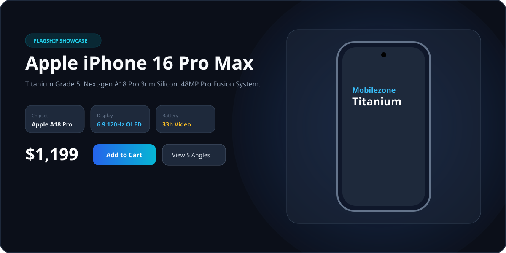
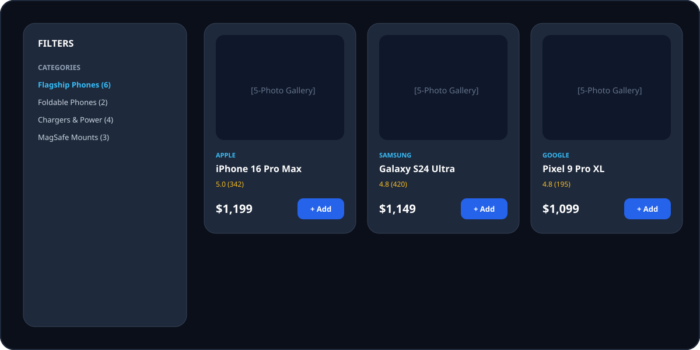
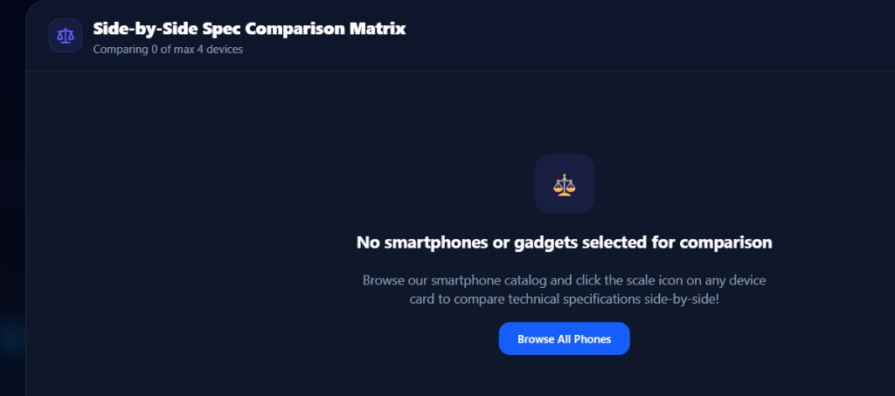
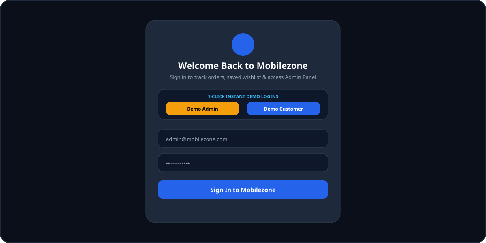
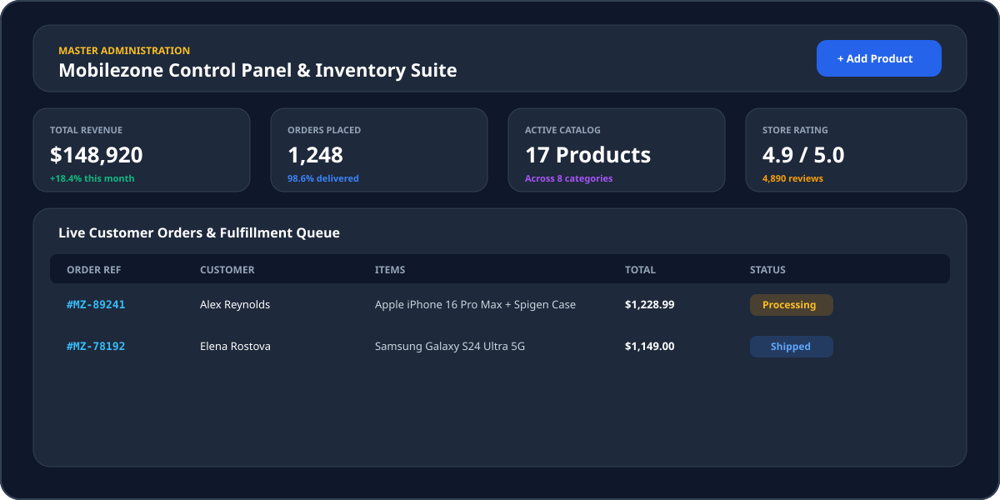

# 📱 Mobilezone - Smartphones & Accessories Market

[](https://react.dev/)
[](https://vitejs.dev/)
[](https://tailwindcss.com/)
[](LICENSE)

A premier, fully responsive e-commerce web application engineered with **React 19**, **Vite**, and **Tailwind CSS v4**. Built for tech enthusiasts, it features flagship smartphones, MagSafe wireless ecosystems, GaN fast chargers, and an interactive administrative suite.

<p align="center">
  
</p>

---

## 📑 Table of Contents

- [✨ Key Features](#-key-features)
  - [1. Multi-Angle High-Resolution Product Galleries](#1-multi-angle-high-resolution-product-galleries)
  - [2. Product Catalog & Smart Filters](#2-product-catalog--smart-filters)
  - [3. Smartphone Spec Comparison Matrix](#3-smartphone-spec-comparison-matrix)
  - [4. Authentication & 1-Click Demo Login](#4-authentication--1-click-demo-login)
  - [5. Master Admin Control Panel](#5-master-admin-control-panel)
  - [6. Accessory Compatibility Matcher](#6-accessory-compatibility-matcher)
  - [7. Old Phone Trade-In Estimator](#7-old-phone-trade-in-estimator)
  - [8. Cart, Coupon Engine & 3-Step Checkout](#8-cart-coupon-engine--3-step-checkout)
- [🛠️ Tech Stack & Architecture](#️-tech-stack--architecture)
- [🚀 Quick Start & Installation](#-quick-start--installation)
- [📂 Project Directory Structure](#-project-directory-structure)

---

## ✨ Key Features

### 1. Multi-Angle High-Resolution Product Galleries
- **5 High-Res Photos per Device**: Front, rear camera island, sides, and lifestyle packaging.
- **Dynamic Colorway Swatching**: Selecting swatches updates the main device preview in real time.
- **Capacity & Variant Switcher**: Live storage selection (128GB, 256GB, 512GB, 1TB) dynamically calculates price adjustments.

---

### 2. Product Catalog & Smart Filters
- Filter by category, global brand, real-time price slider ($0–$2000), 5G readiness, and on-sale discounts.
- Responsive grid and list view layouts with sort options (Featured, Price Low-High, Rating, Discounts).

<p align="center">
  
</p>

---

### 3. Smartphone Spec Comparison Matrix
- Compare up to **4 devices side-by-side**.
- Comprehensive breakdown of Displays (OLED, AMOLED, 120Hz), SoCs (Apple A18 Pro, Snapdragon 8 Gen 3, Tensor G4), Cameras, Batteries, Fast Charging, and direct Add-to-Cart buttons.

<p align="center">
  
</p>

---

### 4. Authentication & 1-Click Demo Login
- Toggle between **Sign In** and **Create Account**.
- **⚡ 1-Click Demo Logins**: Instant login buttons for **👑 Master Admin** and **👤 Customer**.

<p align="center">
  
</p>

---

### 5. Master Admin Control Panel
- **Real-Time KPIs**: Total Revenue ($148,920), Completed Orders (1,248), Active Catalog Items (17+), and Customer Satisfaction (4.9/5.0).
- **Catalog Inventory Management**: Add new products, update prices, manage stock quantities, and remove items.
- **Live Orders Queue**: Track customer orders and update status (`Processing` ➔ `Shipped` ➔ `Delivered`).
- **Promo Code Manager**: Create custom coupon codes with percentage discounts and minimum spend thresholds.

<p align="center">
  
</p>

---

### 6. Accessory Compatibility Matcher
- Filter 100% fitting MagSafe cases, 9H tempered glasses, GaN chargers, and magnetic car mounts for specific smartphone models (*iPhone 16 Pro Max, Galaxy S24 Ultra, Pixel 9 Pro XL*).

---

### 7. Old Phone Trade-In Estimator
- Step-by-step trade-in calculator evaluating model, storage, and cosmetic condition to compute instant cash credit with a 1-click **"Apply Credit to Cart"** button.

---

### 8. Cart, Coupon Engine & 3-Step Checkout
- **Free Express Shipping Meter**: Real-time progress bar towards free 2-day delivery ($50 threshold).
- **Promo Coupon Engine**: Supports codes like `MOBILE20` (20% off), `ZONE10` (10% off), `FREESHIP` ($15 credit), and `SUPER50`.
- **Checkout Wizard**: Shipping details, simulated payment gateways (Card, UPI/QR, Apple Pay, COD), order tracking reference (`#MZ-XXXXX`), and celebratory confetti animations!

---

## 🛠️ Tech Stack & Architecture

- **Core Framework**: React 19 (Hooks, Context API, Suspense)
- **Build Tool**: Vite 8 with `@tailwindcss/vite`
- **Styling**: Tailwind CSS v4 (Glassmorphism, dark/light theme, custom scrollbars)
- **Icons**: Lucide React
- **Celebration Effects**: Canvas Confetti
- **State Persistence**: LocalStorage sync for Cart, Wishlist, Comparison list, Authentication, and Orders.

---

## 🚀 Quick Start & Installation

### Prerequisites
Make sure you have [Node.js](https://nodejs.org/) (v18.0.0 or higher) installed.

### 1. Clone the Repository
```bash
git clone https://github.com/saivamshi38/Mobilezone-React-E-Commerce-Project.git
cd Mobilezone-React-E-Commerce-Project
```

### 2. Install Dependencies
```bash
npm install
```

### 3. Start the Development Server
```bash
npm run dev
```
Open your browser at **`http://localhost:5173`**.

### 4. Build for Production
```bash
npm run build
npm run preview
```

---

## 📂 Project Directory Structure

```
mobilezone-app/
├── public/
│   └── screenshots/         # Hero banner, catalog grid, compare matrix, admin dashboard, auth login
├── src/
│   ├── components/
│   │   ├── admin/           # AdminDashboard, AddProductModal
│   │   ├── auth/            # AuthModal (Sign in & Registration)
│   │   ├── cart/            # CartDrawer, CheckoutModal
│   │   ├── catalog/         # ProductCard, FilterSidebar, ProductGrid
│   │   ├── common/          # Navbar, Footer, StarRating, Badge
│   │   ├── compare/         # PhoneComparisonModal
│   │   ├── home/            # HeroBanner, FlashDeals, BrandShowcase
│   │   ├── product/         # ProductDetailModal, SpecTable, ReviewSection
│   │   ├── tools/           # CompatibilityMatcher, TradeInCalculator
│   │   └── wishlist/        # WishlistDrawer
│   ├── context/             # AuthContext, CartContext, WishlistContext, CompareContext, ThemeContext, ToastContext
│   ├── data/                # products.js, brands.js, categories.js, coupons.js
│   ├── App.jsx              # Main application router and shell
│   ├── main.jsx             # React DOM root entry
│   └── index.css            # Tailwind CSS v4 styling rules
├── index.html
├── package.json
├── README.md
└── vite.config.js
```

---

## 📄 License
This project is open-source and available under the [MIT License](LICENSE).